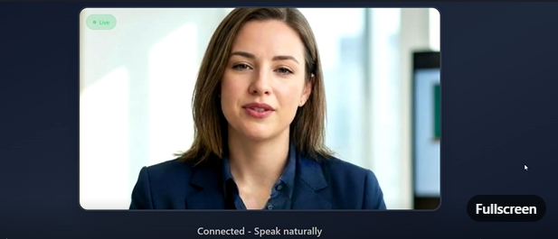

# AI Teacher Voice Agent

> Built for the **ElevenLabs Worldwide Hackathon 2025, London**

An AI instructor that breaks down complex AI concepts into simple, understandable terms through real-time voice conversations. The avatar listens, speaks, and can even analyse images you share mid-session. The entire prototype was put together in around three hours using [bolt.new](https://bolt.new), [Anam](https://anam.ai), and [ElevenLabs](https://elevenlabs.io).

Feel free to chat with her and see how quickly AI topics start to click.

---

## Demo

[View the LinkedIn post](https://www.linkedin.com/posts/phrugsa-limbunlom-5b8995117_id-like-to-share-a-small-project-i-built-activity-7405205201919299584-9fWy?utm_source=share&utm_medium=member_desktop&rcm=ACoAAB0n2hwB2yEe472AMqoa_Ngv5Lql7y1lFHw)

[](https://www.linkedin.com/posts/...)

---

## Features

- Real-time AI avatar powered by Anam with natural voice interaction
- Friendly AI teacher persona designed to explain AI concepts without jargon
- Image sharing during a live session so you can ask questions about any image
- Automated image analysis via a Supabase Edge Function connected to Blackbox AI
- Conversation history persisted in Supabase tables

---

## Tech Stack

| Layer | Technology |
|---|---|
| Frontend | React 18, TypeScript, Vite, Tailwind CSS |
| Avatar and voice | Anam JavaScript SDK |
| Backend functions | Supabase Edge Functions (Deno) |
| Image analysis | Blackbox AI (pixtral-12b) |
| Database | Supabase (PostgreSQL, RLS) |
| Icons | Lucide React |

---

## Project Structure

```text
src/
  components/VoiceAgent.tsx     Main UI and session controls
  hooks/useAnamClient.ts        Anam connect, disconnect, and messaging logic
  lib/supabase.ts               Supabase browser client
  lib/image-analysis.ts         Calls the image analysis edge function

supabase/
  functions/get-anam-token/     Issues an Anam session token
  functions/analyze-image/      Describes an image using Blackbox AI
  migrations/                   SQL schema and RLS policy files
```

---

## Getting Started

### Prerequisites

- Node.js 18 or newer
- A [Supabase](https://supabase.com) project
- An [Anam](https://anam.ai) API key
- A [Blackbox AI](https://blackbox.ai) API key

### 1. Install dependencies

```bash
npm install
```

### 2. Configure environment variables

Create a `.env` file in the project root and add your Supabase credentials.

```env
VITE_SUPABASE_URL=your_supabase_project_url
VITE_SUPABASE_ANON_KEY=your_supabase_anon_key
```

### 3. Run database migrations

Apply both migration files in your Supabase project, in order.

```
supabase/migrations/20251211142311_create_conversations_schema.sql
supabase/migrations/20251211201543_fix_conversations_rls_policies.sql
```

### 4. Set edge function secrets

Add these secrets in your Supabase project settings or via the CLI.

```
ANAM_API_KEY=your_anam_api_key
BLACKBOX_API_KEY=your_blackbox_api_key
```

### 5. Deploy edge functions

```
supabase/functions/get-anam-token
supabase/functions/analyze-image
```

### 6. Start the dev server

```bash
npm run dev
```

Open the local URL that Vite prints, click **Start Session**, and begin speaking.

---

## Scripts

| Command | Description |
|---|---|
| `npm run dev` | Start the development server |
| `npm run build` | Create a production build |
| `npm run preview` | Serve the production build locally |
| `npm run lint` | Run ESLint |
| `npm run typecheck` | Run TypeScript type checks |

---

## Security Note

The second migration opens public access to the conversations table, which is suitable for a demo or hackathon. Before deploying to production, replace those policies with proper authentication-based access controls.

---

## Credits

- [bolt.new](https://bolt.new)
- [Anam](https://anam.ai)
- [ElevenLabs](https://elevenlabs.io)
